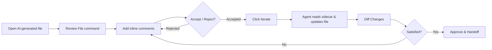

<!-- [Co-Steer] pending review: README.md.review.md -->
# Co-Steer

Universal Artifact Review and Co-Steering.

> [!WARNING]
> **Compatibility Notice:** Co-Steer is primarily designed and intended for use within the **Antigravity IDE** environment. While it can run in standard Visual Studio Code, it has not been thoroughly tested in VS Code and some integrations may exhibit unexpected behavior or fall back to manual clipboard options.

Co-Steer decouples the **Artifact → Inline Comment → Update → Approve** workflow from any single AI extension or chat panel. It uses your local file system as the single source of truth: your comments and instructions are stored in structured `.review.md` sidecar files that any CLI agent (such as Claude Code or local LLMs) can read, modify, and act on.

---

## How it Works



### Phase 1 — Review & Comment

1. **Start Review:** Open any file generated/modified by an AI agent and trigger the **Review File** command. This opens the file as a read-only `ai-review://` virtual document and registers it in the **Co-Steer** sidebar tree view.

   

2. **Comment Gutter:** Highlight any line range in the virtual document and add an inline comment. Co-Steer writes a structured `<review_item>` XML block to a companion `<filename>.review.md` sidecar file.

   

3. **Review States:** Each comment moves through four states:
   - `pending` — new comment awaiting a decision
   - `accepted` — approved for the agent to implement
   - `rejected` — dismissed, no action needed
   - `resolved` — implemented and closed


### Phase 2 — Agent Iteration

4. **Agent Iteration:** Click **Iterate** in the sidebar. Co-Steer captures a pre-iteration snapshot baseline, launches your configured CLI agent (passing the artifact path as an argument), and pipes the complete instruction set from the sidecar directly into the agent's `stdin`.

5. **Diff Changes:** Click the **Diff** icon to compare the pre-iteration baseline with the current code, visualizing exactly what the agent changed.

   

6. **Direct Agent Handoffs:** When working inside markdown-based plan files, dedicated buttons allow direct handoffs:
   - **🚀 Antigravity:** Sends the prompt straight into the Antigravity Agent Panel (falls back to clipboard if running in standard VS Code).
   - **🤖 Claude:** Launches a deep link to the official Claude Code VS Code extension. The handler automatically scans `~/.claude/sessions` and checks active process PIDs to target your **currently active Claude conversation session** in the workspace rather than opening a new tab.

### Phase 3 — Approval & Handoff

7. **Approve:** Clicking **Approve** deletes the sidecar and clears baseline snapshots. For Markdown artifacts, you can pipe the approved contents straight to your agent as a prompt instruction.

---

## Commands

| Command | Title | Description |
|---|---|---|
| `co-steer.reviewFile` | `Review File` | Starts a review on the active file, opening a virtual document and creating a sidecar. |
| `co-steer.copyPrompt` | `Copy Agent Prompt` | Assembles sidecar instructions into a canonical prompt and copies it to the clipboard. |
| `co-steer.addComment` | `Add Comment` | Serializes highlighted code + feedback and appends it to the sidecar. |
| `co-steer.iterate` | `Iterate with Agent` | Snapshots the file and launches the configured CLI agent, piping the sidecar content over stdin. |
| `co-steer.diff` | `Diff vs Target` | Displays a side-by-side diff comparing the pre-iteration snapshot with current workspace content. |
| `co-steer.approve` | `Approve Artifact` | Deletes the `.review.md` sidecar and optionally runs approved plans as agent prompts. |
| `co-steer.sendPromptToAntigravity` | `Send to Antigravity` | Hands off the current review prompt directly to the Antigravity Agent Panel. |
| `co-steer.sendPromptToClaude` | `Send to Claude` | Hands off the prompt to the active Claude Code extension tab via custom protocol handler. |

---

## Configuration Settings

Define these settings in your global `settings.json` or project `.vscode/settings.json` file:

* **`co-steer.agentCommand`** (String, default: `""`):
  The executable to run on iteration (e.g., `"claude"` or `"node"`). The artifact file path is appended as the final argument. If left empty, a mock iteration runs.
* **`co-steer.agentArgs`** (Array of Strings, default: `[]`):
  Additional arguments passed to the agent command before the artifact path.
* **`co-steer.promptPrefix`** (String, default: `"Execute the following approved plan:"`):
  Text prepended to approved Markdown plans when executing them via "Run as prompt".
* **`co-steer.customCommentSyntaxes`** (Object, default: `{}`):
  A dictionary mapping VS Code language IDs or file extensions to custom comment syntaxes for injecting the sidecar pointer.
  *Example:*
  ```json
  "co-steer.customCommentSyntaxes": {
    "json": "//",
    "html": ["<!--", "-->"]
  }
  ```

---

## Sidecar Schema (`.review.md`)

Each sidecar file contains a list of review items written in clean XML tags readable by human developers and AI models:

```markdown
# Review Comments for `src/sample.ts`

<review_item id="r-3f9c2d1b" status="pending">
<location>
File: `src/sample.ts`
Lines: 15-22
</location>

<target_code>
```typescript
function calculateTotal(items: number[]): number {
    return items.reduce((a, b) => a + b, 0);
}
```
</target_code>

<comment author="You">
Optimize this to use a simple loop if performance becomes a concern.
</comment>

<comment author="Agent">
Understood. Spawning loop replacement.
</comment>
</review_item>

<!-- COSTEER_RESOLVED_START
<review_item id="r-8b2c4d6a" status="resolved">
...
</review_item>
COSTEER_RESOLVED_END -->
```

---

## Contributing & Development

To build and run tests locally:

1. **Install Dependencies:**
   ```bash
   npm install
   ```
2. **Build and Package:**
   ```bash
   npm run package      # typecheck and compile a production bundle
   ```
3. **Run Integration Test Suite:**
   ```bash
   npm run test         # launches test suite in a headless VS Code instance
   ```
4. **Local Installation:**
   Pack the extension into a `.vsix` file and install it locally:
   ```bash
   npm run install-local
   ```
