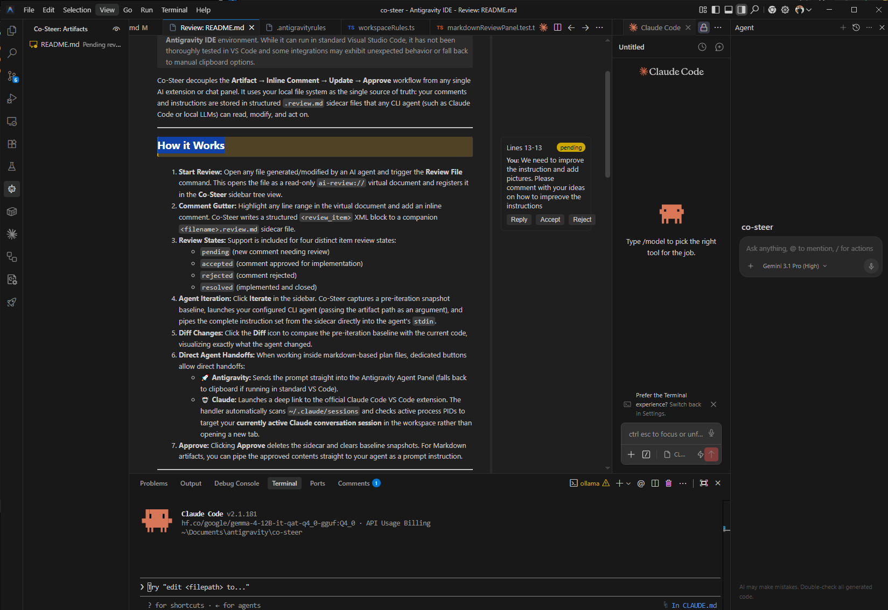

<!-- [Co-Steer] pending review: README.md.review.md -->
# Co-Steer

Universal Artifact Review and Co-Steering.

> [!WARNING]
> **Compatibility Notice:** Optimized for the **Antigravity IDE**. Standard VS Code is supported but integrations may fall back to manual clipboard options.

Co-Steer provides an AI-agnostic **Review & Co-Steering** workflow. It stores review instructions in `.review.md` sidecar files, allowing any CLI agent (like Claude Code) to read, modify, and act on your feedback.

---

## How it Works


### 1. Review & Comment
- **Start Review:** Run the **Review File** command on an AI-generated file. 
  
- **Add Comments:** Highlight lines and add comments. Co-Steer saves these in a companion `.review.md` sidecar.
  
- **States:** Manage comments via `pending`, `accepted`, `rejected`, and `resolved` states.

### 2. Agent Iteration
- **Iterate:** Click **Iterate** to launch your CLI agent with the sidecar instructions.
- **Diff:** View a side-by-side diff comparing the pre-iteration baseline with the new code.
  
- **Handoffs:** Send prompts directly to the **Antigravity Agent Panel** or **Claude Code**.

### 3. Approve
- **Approve:** Accept changes to delete the sidecar and optionally pipe the final content back to your agent.

---

## Commands

| Command | Description |
|---|---|
| `co-steer.reviewFile` | Starts a review on the active file. |
| `co-steer.copyPrompt` | Copies sidecar instructions to clipboard. |
| `co-steer.addComment` | Adds a comment to the sidecar. |
| `co-steer.iterate` | Launches the CLI agent with the sidecar. |
| `co-steer.diff` | Diff the pre-iteration snapshot with current content. |
| `co-steer.approve` | Deletes the sidecar and optionally runs approved plans. |
| `co-steer.sendPromptToAntigravity` | Hands off the prompt to Antigravity Agent Panel. |
| `co-steer.sendPromptToClaude` | Hands off the prompt to Claude Code extension. |

---

## Configuration Settings

- **`co-steer.agentCommand`** (String, `""`): CLI command to run on iteration (e.g., `"claude"`).
- **`co-steer.agentArgs`** (Array, `[]`): Extra arguments for the agent.
- **`co-steer.promptPrefix`** (String): Text prepended to executed Markdown plans.
- **`co-steer.customCommentSyntaxes`** (Object): Custom comment syntax mappings (e.g., `{"json": "//"}`).

---

## Sidecar Schema (`.review.md`)

```xml
<review_item id="r-3f9c2d1b" status="pending">
<location>File: `src/sample.ts` Lines: 15-22</location>
<target_code>...</target_code>
<comment author="You">Optimize this loop.</comment>
</review_item>
```

---

## Development

```bash
npm install
npm run package      # Build extension
npm run test         # Run tests
npm run install-local # Pack and install .vsix
```
